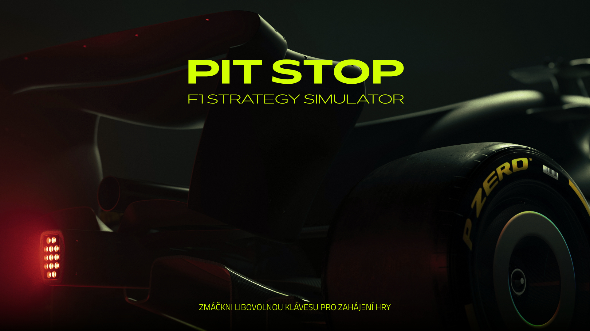

# PITSTOP 🏎️

> **Strategický simulátor závodů Formule 1.**
> Nejde o to, jak rychle umíš točit volantem, ale jak rychle se umíš rozhodovat na pitwallu.

Tento projekt je kompletní hra napsaná v jazyce **Delphi (Pascal)** bez použití externích herních enginů. Slouží jako ukázka algoritmizace herní smyčky, práce s grafikou na nízké úrovni a UI designu.

## 🏁 O hře

V PitStop F1 se vžijete do role závodního inženýra. Vaším úkolem není auto řídit, ale dostat ho do cíle na prvním místě pomocí správné strategie. Musíte reagovat na dynamicky se měnící podmínky závodu.

### Hlavní mechaniky
* **Dynamické počasí:** Změna z sucha na déšť vyžaduje okamžitou reakci a přezutí pneumatik.
* **Management pneumatik:** Volba mezi měkkou (rychlou, ale s nízkou výdrží) a tvrdou sadou.
* **Spotřeba paliva:** Lehčí auto jede rychleji, ale musí častěji tankovat.
* **Reálná simulace:** Vozy se pohybují po trati na základě fyzikálních parametrů, ne jen náhodně.

## 💻 Technické řešení

Celá hra byla vytvořena "from scratch" v prostředí **Borland Delphi**.

* **Jazyk:** Object Pascal
* **Grafika:** Vlastní vykreslovací smyčka (Canvas / GDI), sprite animace vozů.
* **Audio:** Implementace zvukových efektů motorů a prostředí.
* **AI:** Počítačem řízení oponenti, kteří reagují na stav trati a své opotřebení.

## 🎨 UI & Grafika

Jako designér jsem kladl důraz na přehlednost uživatelského rozhraní. Hra obsahuje kompletní sadu vlastní grafiky – od pixel-artových spritů formulí až po ovládací panely inspirované telemetrií F1.

## 📸 Ukázky

---

### 👨‍💻 Autor

**adam zima**
[adamzima.cz](https://adamzima.cz).

*Vytvořeno jako seminární projekt.*
